# Workshop 6  Performance-testing

Мониторинг.md - 1 часть воркшопа - настройка системы мониторинга.
Yandex-Tank-Обзор.md - 2 часть 1 воркшопа. Краткий обзор и словарик.

Воркшоп по Jmeter.

1) Устанавливаем Jmeter 5.5:

* Сделаем пул контейнера:

```bash
docker pull gitlab-registry.ozon.dev/qa/classroom-4/yandex-tank:jmeter
```

* для mac-os
* ```brew install jmeter ```
* для linux:
  ```apt-get update && apt-get install jmeter```

2) Запускаем Jmeter в терминале ```jmeter``` -> Появится окно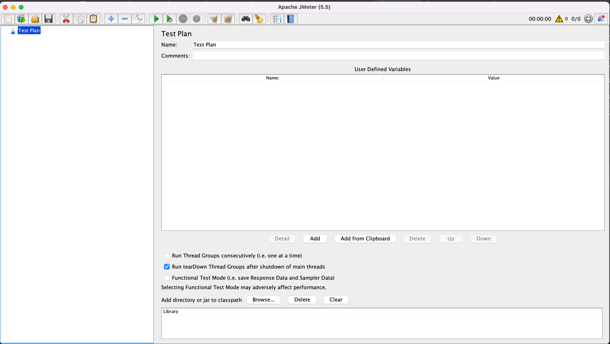
3) Запускаем Plugin Manager 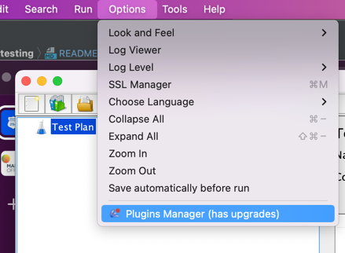
4) Устанавливаем плагины:

   * Custom Thread Group
   * JMeter gRPC Request
   * Custom JMeter Functions
   * jpgc - Standard Set
5) Жмем Apply changes and restart jmeter
   Давайте разработаем сценарий вида:

   1) Получаем список устройств - 3 раза
   2) Создаем устройство и запоминаем его ID
   3) Получаем созданное устройство по ID

[//]: #
[//]: #
[//]: #
[//]: #
[//]: #
[//]: #
[//]: #
6) Добавляем первую Thread Group 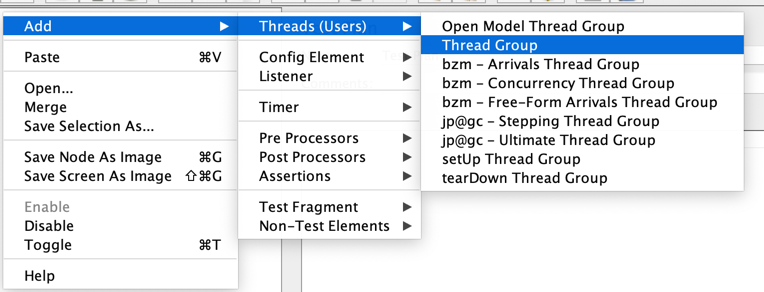 Ничего не настраиваем. Ее будем использовать в разработке теста.
7) Для выполнения запросов HTTP запросов добавляем HTTP sampler 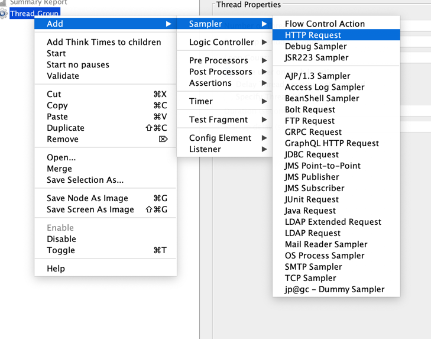

   * Name: http_ListDevices
   * Http: GET
   * Path: /api/v1/devices?page=1&perPage=10
     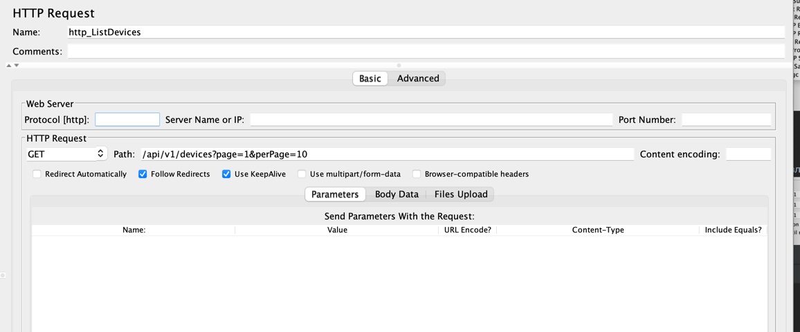
     Остальные поля оставляем пустыми.
8) Для того чтобы не писать постоянно host и порт в каждом сэмпле - добавляем HTTP Requests Defaults 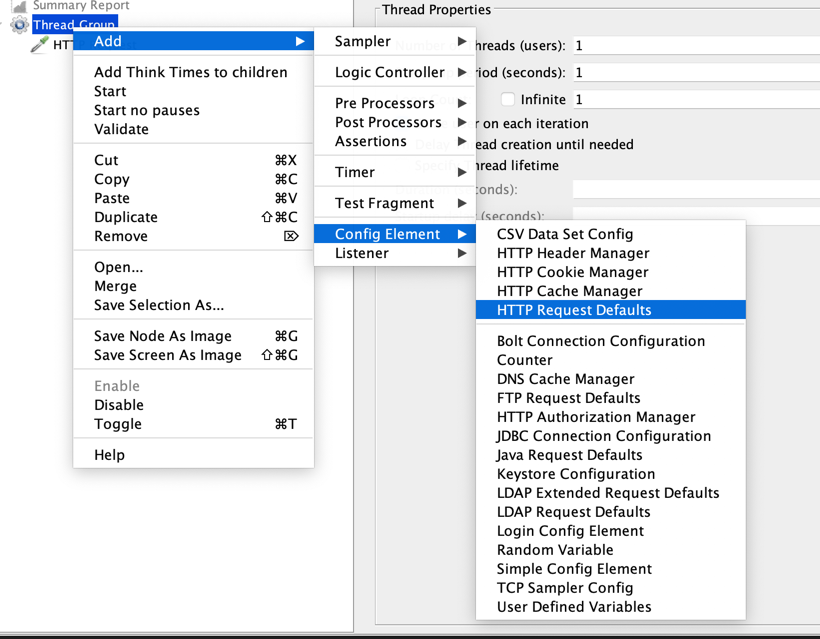
9) В нем настроим - параметры - общие для всего теста:

   * host: localhost
   * port: 8083
   * protocol: http
   * Advanced-> Implementation: HttpClient4
10) Обычно в Тесты надо параметризовывать: Давайте создадим элемент User Defined Variables  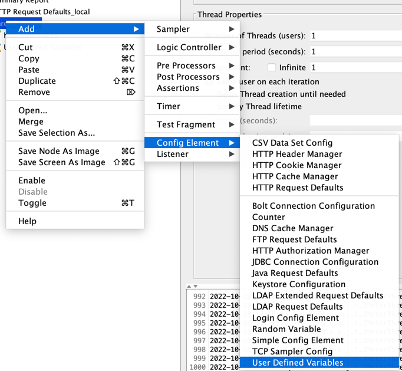

* Вынесем туда host, port, protocol - Это нужно для дебага. Мы будем пробрасывать эти переменные с помощью танка. Но для локального запуска нам нужно чтобы работало так же.

```
В Jmeter 2 типа переменных:

vars - Контекст переменной - в рамках 1 потока. ${varname} - Плейсхолдерит varname - на ее значение. 
props - Контекст переменной - в рамках 1 JVM. ${__P(propname,[defaultPropValue])} (Может быть размещена во внешнем файле или как аргумент запуска JVM -D

vars и props - могут хранить объекты

```

[Документаций на properties](https://jmeter.apache.org/usermanual/functions.html#__P_)

11) В HTTP Request Defaults заменим настройки:

* protocol: ${protocol}
* port: ${port}
* host: ${host}

11) Для Дебага Запросов и ответом - добавим View Results Tree (ВАЖНО - Его надо выключать при реальном тесте! Он потребляет ОЧЕНЬ много ресурсов.) 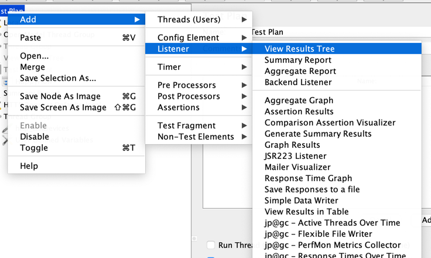
12) Для Цикла используем Loop Controller 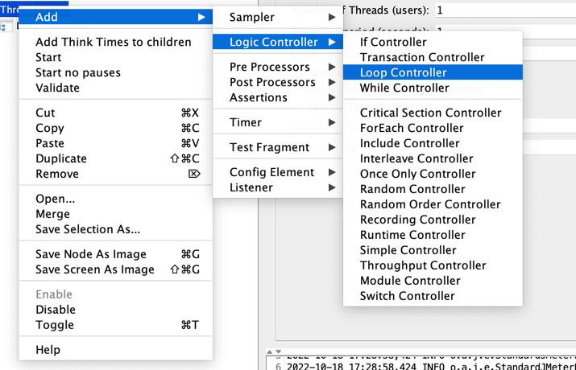 с настройокой 3. Под него помещаем наш http_ListDevices HTTP Sample.
13) Чтобы рандомно запрашивать номера страниц добавим в наш цикл Random Variable элемент: 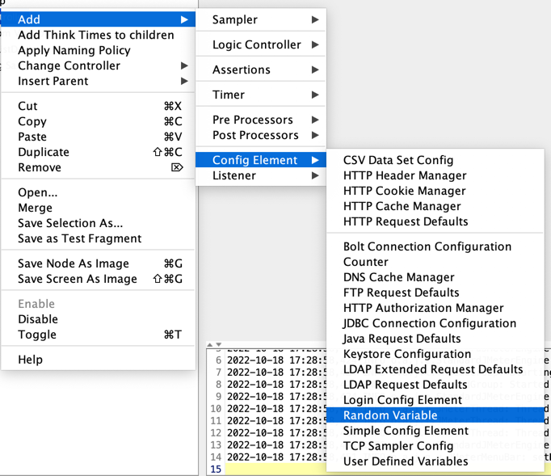
    Настроим его следующим образом:
    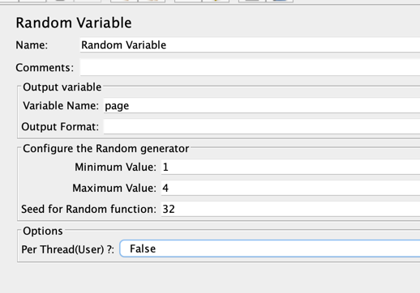

* Variable name: page
* Minimum value: 1
* Maximum value: 4
* Seed for Random function: любое число( чтобы тест был воспроизводим со статистической точки зрения)
* PerThread(user): False - Переменная будет рандомизирована в рамках всех пользователей. Иначе Рандом будет работать в рамках конкретной треды - что может создавать ненужные спайки.

ПРАВИТЬ ТУТ!


14) Давайте следующий запрос отправим по grpc. Для этого нам надо добавить grpc Request sample
    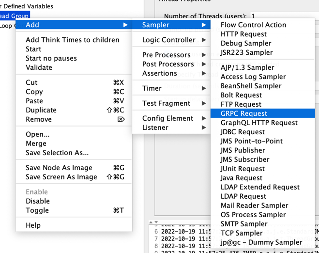
    Для настроек плагина нам потребуется указать Host, Port. Host у нас уже есть - впишем в него переменную ${host}. В поле port впишем ${proto.port}
15) Добавим в наш User Defined Variables переменную proto.port: 8082
16) grpcSample не умеет строить клиента через Рефлексию. Для этого ему нужно указать папку с proto файлами. Плюс в системе должен быть установлен protoc.
17) Давайте создадим в UDV - переменные с названием proto.root.dir и proto.lib.dir
    В **proto.root.dir** пропишем путь: ```[ваш путь до проекта device-api]/device-api/api/ozonmp/act_device_api/v1```
    В **proto.lib.dir** пропишем путь к общей папке с прото-файлами ```[ваш путь до проекта device-api]/device-api/api```

* В Настройках **grpc Request** для начала впишем пути вручную для первой генерации клиента. В дальнейшем мы заменим пути на те, что указаны в переменных. Это будет нужно для дальнейшего запуска теста в танке.
* Нажимаем кнопку Listing. Смотрим логи JM. В логах нет ошибок. Появился список grpc Методов.
* Выбираем CreateDeviceV1. В поле Send Json Formatted Request появился шаблон заполнения запроса.
* Переименуем данный семпл в **grpc_CreateDeviceV1**.
* Заменим пути к папкам на переменные ${proto.root.dir} и ${proto.lib.dir} соответственно.

18) Давайте попробуем создать запрос динамически с помощью groovy. Для этого кликнем на наш семл и добавим jsr223 pre-processor. 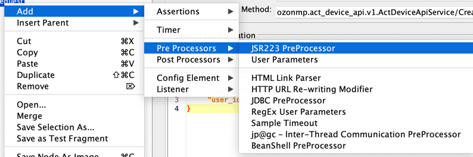
19) Выберем язык groovy. В Jmeter он самый быстрый. Остальные реализации пре-процессоров тормозят.
20) Обязательно должна стоят кнопка cache complied Script if Awailible. Это позволяет скомпилировать ваш скрипт. Иначе он будет компилироваться каждый раз при вызове, что потребляет ресурсы.
21) В тело скрипта давайте поместим следующий код:

```
import  groovy.json.JsonOutput
import org.apache.commons.lang3.RandomUtils
import org.apache.commons.lang3.RandomStringUtils

def createDeviceV1Req = JsonOutput.toJson([platform: RandomStringUtils.randomAlphabetic(5), user_id: RandomUtils.nextInt()])

vars.put("createDeviceV1Req",createDeviceV1Req)
```

1 - Импортируем groovy библиотеку по работе с json: **groovy.json.JsonOutput** (гуглится простым HowTo)
2 - Импортируем библиотеки генерации случайных чисел и строк из стандартного пакета java.lang3. 
3 - Создадим объект с нашим запросом. В качестве платформы впишем простую строку: ios. (Обычно используют различные генераторы тестовых данных. В дальнейшем мы это место параметризируем с помощью csv Data-Set.)
4 - В качестве user_id - сгенерируем случайное число.
5 - JsonOutput.toJson - создаст из groovy объекта - json.
6 - Поместим получившийся Json в vars по ключу createDeviceV1Req.
22) В grpc_CreateDeviceV1 семпле в качестве тела запроса укажем: ${createDeviceV1Req}
23) Протестируем.
24) Запишем созданное устройство в переменную. Можно написать post-processor на groovy:
    Вариант 1
    [prev](https://jmeter.apache.org/api/org/apache/jmeter/samplers/SampleResult.html)

```
//Импортируем JsonSlurper - для работы с Json
import groovy.json.JsonSlurper
//Получаем из предыдущего семпла ответ в виде строки
def device = prev.getResponseDataAsString()
//Получаем из переменных уровня приложения(props) инстанс слерпера 
def slurper = props.get("slurper")
//Если он пустой - тогда создаем его
if (slurper == null) {
	log.info("Create New slurper")
	slurper = new groovy.json.JsonSlurper()
	//Записываем в переменные уровня приложения(При Разработке в GUI они живут пока вы не перезапустите приложение.)
	props.put("slurper",slurper)
} else{
	log.info("Use Existing slurper")
}
 //Десереализуем ответ от grpc в объект
deviceObj = slurper.parseText(device)
log.info(device)
 //Вытащим из него device_id - и запишем в переменные уровня потока(vars) по ключу deviceId 
vars.put("deviceId",deviceObj.device_id)
```
25) Есть и альтернативный вариант экспорта. Можно воспользоваться готовым экстрактером JSON Extractor. 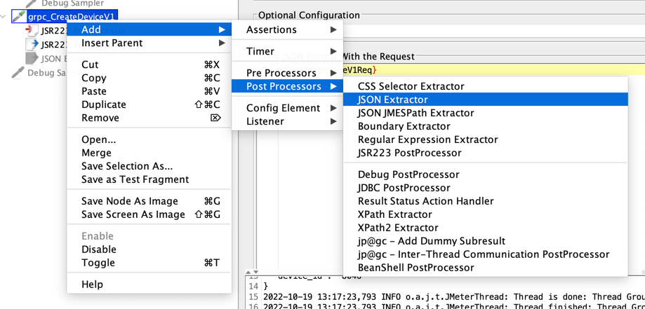
26) Давайте его настроим как на картинке:
27) 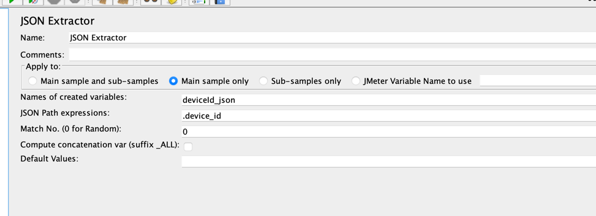
    * Name of created variable: deviceID_json,
    * JSON path expression: ```.device_id```  - Это выражение на языке JsonPath - как xPath, только для Json. [Пример](https://jsonpath.com/)
    * Match No: 0
28) Сам тест настроили. Теперь давайте настроим тест таким образом чтобы мы могли вызвать заданную частоту сценариев в секунду.
29) Давайте добавим еще 1 запрос - на этот раз HTTP.
    Скопируем Http Семплер и переименуем в http_describeDevice:

* Тип запроса GET
* Путь: /api/v1/devices/${deviceId}

30) Добавим подтягивание данных из csv файла:
    Добавим в корень теста CSV DataSet
31) 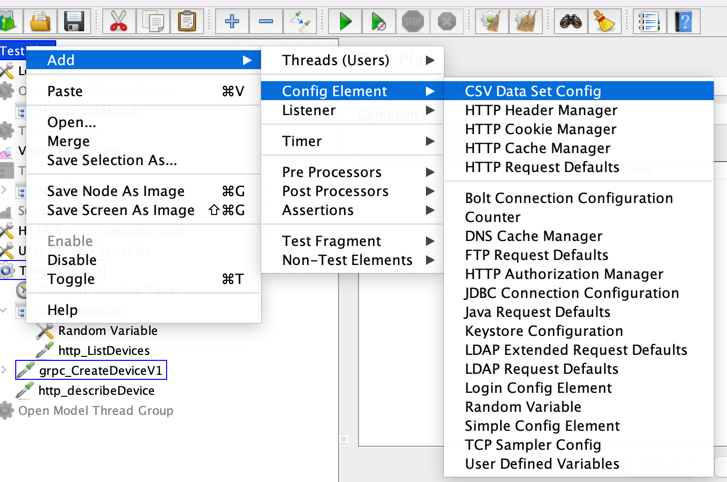
32) Настроим его как на картинке:
    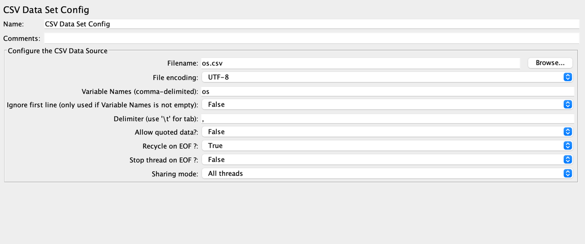

* filename - путь к файлу. Если указать фай без пути - будет автоматически использоваться тот в котором лежит наш файл с тестом.
* Создадим папку **datapools**.
* В ней создадим файл: os.csv со следующим содержимым:

```csv
ios
android
Windows Mobile
```
29) Давайте используем новую OpenModelThreadGroup от автора Jmeter-plugins.
30) Настроим ее
31) Вынесем настройку в переменную
32) Перенесем наш сценарий под нее.
33) Донастроим load.yaml

```
jmeter:
  enabled: true
  jmx: load.jmx
  args: -J jmeter.save.saveservice.autoflush=true -J jmeterengine.threadstop.wait=60000
  variables:
    host: act-device-api
    port: 8080
    proto.root.dir: 'protodir/ozonmp/act_device_api/v1'
    proto.lib.dir: 'protodir'
    proto.port: 8082
    jmeter_ver: 5.5
    profile: rate(1/s) random_arrivals(1 min) rate(5/s) random_arrivals(3 min)
```
34) Выключим pandora
35) Запустим наш тест:
36)

```bash
docker run --network ozon_route256_ompnw -v $(pwd):/var/loadtest --rm -it gitlab-registry.ozon.dev/qa/classroom-4/yandex-tank:jmeter 'yandex-tank -f load.yaml'
```
