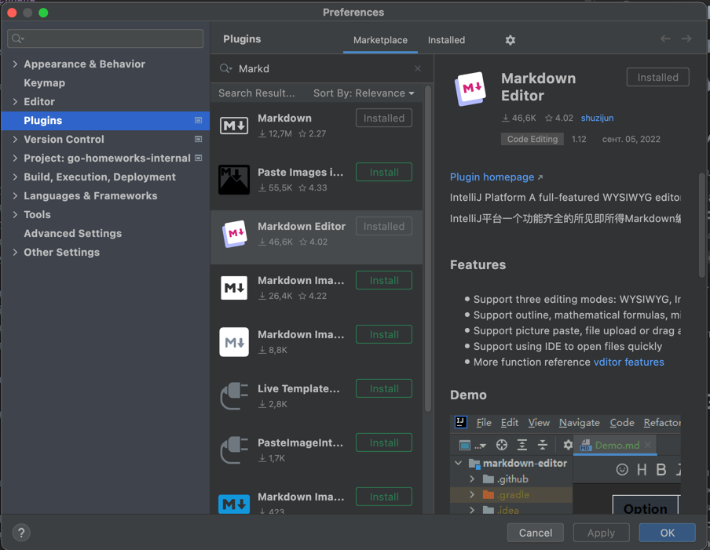
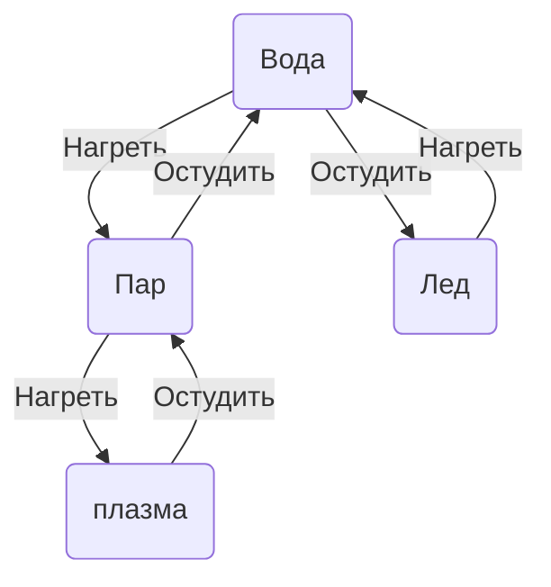

# Домашнее задание - Основы GO и Практикум по тест-дизайну

## Предварительные условия

### 1 - Установите плагин Markdown Editor

1. Установите плагин Markdown Editor в Goland
   Preferences-> Plugins-->Marketplace -->Markdown Editor
   
   Он сильно упростит вам жизнь и процесс написания тест-кейсов.

## 2.1 Основы GO

### Что сделать:

1. Необходимо реализовать одну из функций на выбор:

* Исправлять в предложениях первую букву в предложениях на большую, добавить точку в конце, если надо ("hello world. with pleasure" -> "Hello world. With pleasure.")
* Найти среднее арифметическое из всех чисел слайса;
* Найти разницу между самым большим и самым маленьким числом в слайсе

### Критерий приемки:

1. Реализована простое приложение на языке GO;

## 2.2 Тест-Дизайн

### 2.2.1 Понимание рисков

#### Дано

1. В вашем проекте есть папка requirements;
2. Скопируйте в нее файл risk-examples.md из этого репозитория;
3. Переименуйте файл в risk.md;
4. Дальнейшую работу над заданием проводите в данном файле.

#### Что сделать?

1. Выбрать 3-4 условия работы вашего приложения.
2. Подумать
3. Заполнить табличку с рисками вашего приложения

#### Критерии приемки

1. Условия выбраны
2. Таблица с рисками заполнена

### 2.2.2 Тест-дизайн приложения

#### Термины

Базовый тест-план - Тест план, включающий только HappyFlow тесты.

Расширенный тест-план - Тест план, включающий любые наборы тестов.

#### Дано

В вашем проекте есть папка requirements. В файле requirements.md  расписаны требования к приложению. Ориентируйтесь на них, при составлении тест-кейсов и чек-листов.

#### Что сделать

1. В папке requirements лежит файл: Test-Plan.md c шаблоном заполнения тестов.
2. Составьте в нем Базовый тест-план проверок по сервисам:
   1. ActDeviceApiService
   2. ActNotificationApiService*

*Важно: В процессе составления тест-плана, старайтесь применять методики тест-дизайна. Тест план по ActNotificationApiService (пункт 2.1 ТЗ) - может быть достаточно сложным. Потренируйтесь в применении PairWise testing.

#### Критерии приемки

1. Покрыты HappyFlow требований, Применены методики тест-дизайна:
   1. ActDeviceApiService
   2. ActNotificationApiService

Кристаллик: Если при составлении тест-плана ориентировались в том числе на условия работы приложения, выбранные при решении 2.2.1 (Эти места должны быть помечены комментарием.)

# 3.0 Дополнительные задания

**Время сдачи**: До конца курса

**Оценка**: Кристаллик за задание.

Всего можно заработать: 4 кристаллика.

## 3.1 Расширенный набор тест-кейсов

### Что сделать

1. Написать Расширенный набор тест-кейсов

### Критерий приемки

1. Тесты отражают полное покрытие требований.
2. Применены методики тест-дизайна.

## 3.2 Диаграммы состояний

### Что сделать

Создать в папке requirements файл: diagrams.md

В нем нарисовать диаграммы состояний для сущностей:

1. device
2. device_event
3. notification

### Как рисовать

https://mermaid.live/

Пример:

### Критерий приемки

1. Нарисованы диаграммы состояний для сущностей: device, device_event, notification_event
2. Диаграммы отражают реальные вохможные состояния данных сущностей

### Оценка

Кристаллик

## 3.3 Архитектура

### Что сделать

Создать в папке requirements файл: architecture.md

В нем нарисовать архитектуру сервиса act_device_api(+ act_notification_api)

### Критерий приемки

1. Нарисована архитектура сервиса. Отображены элементы и докер-контейнеры, а так же направленя их взаимодействия.

### Оценка

Кристаллик

## 3.4 Нефункциональные требования

### Что сделать

1. В папке requirements создать файл nonfunctional.md
2. В нем расписать нефункциональные требования к системе, исходя из выбранных условий работы системы и модели рисков в пункте 2.2.1

### Критерий приемки

* В файле nonfunctional.md Расписаны нефункциональные требования к системе.
* Требования обоснованы контекстом работы приложения и моделью рисков.
