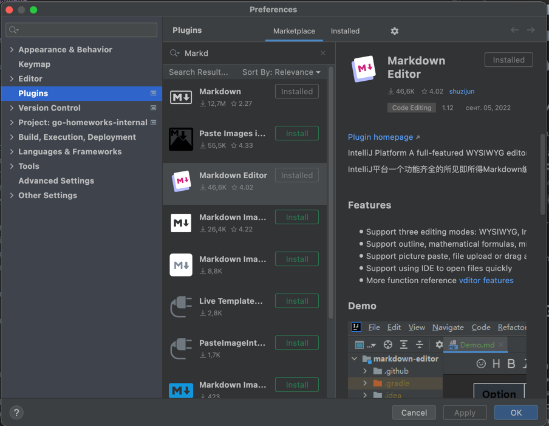

# Домашнее задание - Основы GO, HttpClient и Практикум по тест-дизайну

## Предварительные условия

### 1 - Установите плагин Markdown Editor

1. Установите плагин Markdown Editor в Goland
   Preferences-> Plugins-->Marketplace -->Markdown Editor
   
   Он сильно упростит вам жизнь и процесс написания тест-кейсов.

## 2.1 Основы GO

### Что сделать:

1. Необходимо реализовать функцию:

* Исправлять в предложениях первую букву в предложениях на большую, добавить точку в конце, если надо ("hello world. with pleasure" -> "Hello world. With pleasure.")

#### Дополнительные задания:
* Найти среднее арифметическое из всех чисел слайса (Кристаллик);
* Найти разницу между самым большим и самым маленьким числом в слайсе(Кристаллик)

### Критерий приемки:

1. Реализовано простое приложение на языке GO;

## 2.2 Тест-Дизайн

### 2.2.1 Тест-дизайн приложения

#### Термины

Базовый тест-план - Тест план, включающий только HappyFlow тесты.

Расширенный тест-план - Тест план, включающий любые наборы тестов.

#### Дано

В дз в папке requirements. В файле requirements.md  расписаны требования к приложению. Ориентируйтесь на них, при составлении тест-кейсов и чек-листов.

#### Что сделать

1. В папке requirements лежит файл: Test-Plan.md c шаблоном заполнения тестов.
2. Составьте в нем Базовый тест-план проверок по сервису:
   1. ActDeviceApiService

*Важно: В процессе составления тест-плана, старайтесь применять методики тест-дизайна. 

#### Критерии приемки

1. Покрыты HappyFlow требований, Применены методики тест-дизайна:
   1. ActDeviceApiService

## 2.3 Http Client

### Что сделать:

1. Повторить действия преподавателя на лекции 2.2 HTTP клиенты на Go

### Критерий приемки:

1) Сгенерирован свой HTTP клиент на основе swagger
2) В наличии папка test в которой:
   - Реализован тест на стандартном net/http клиенте
   - Реализован тест на Сгенерированном через swagger http клиенте
   - Реализован тест, который придумали ранее на свой выбор на сгенерированном HTTP клиенте
# 2.4 Дополнительные задания (кристаллик)

## 2.4.1 Расширенный набор тест-кейсов

### Что сделать

1. Написать Расширенный набор тест-кейсов

### Критерий приемки

1. Тесты отражают полное покрытие требований.
2. Применены методики тест-дизайна.
3. Добавлены нефункциональные тесты.

### Оценка

Кристаллик

## 2.4.2 Архитектура

### Что сделать

Создать в папке requirements файл: architecture.md

В нем нарисовать архитектуру сервиса act_device_api

### Критерий приемки

1. Нарисована архитектура сервиса. Отображены элементы и докер-контейнеры, а так же направленя их взаимодействия.

### Оценка

Кристаллик

## 2.4.3 Нефункциональные требования

### Что сделать

1. В папке requirements создать файл nonfunctional.md
2. В нем придумать нефункциональные требования к системе, исходя из придуманных условий работы системы.

### Критерий приемки

* В файле nonfunctional.md Расписаны нефункциональные требования к системе.
* Требования обоснованы контекстом работы приложения и моделью рисков.

### Оценка

Кристаллик