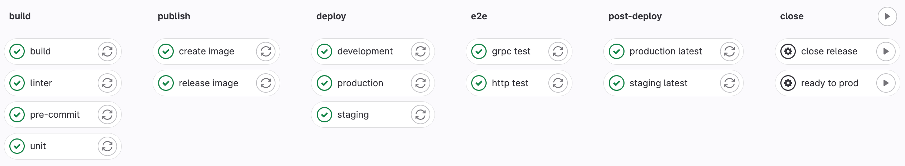

# Домашнее задание

## Код из воркшопа:
 - https://gitlab.ozon.dev/qa/classroom-8/students/act-device-api/-/merge_requests/2
 - возьмите себе изменения
  - кроме директории `test`. Вместо этого используйте свои `e2e-тесты`
  - кроме изменений в go.mod и go.sum. Вместо этого всегда используйте команду `go mod tidy`

## Подготовка:

Скопировать в проект заготовки:
- `.gitlab-ci.yml`
- `.golangci.yml`
- `.pre-commit-config.yaml`
- `.protolint.yaml`

## Задание:

- Повторить действия из урока
  - Реализовать джобы
    - `build`
    - `unit`
    - `linter`
    - `pre-commit`
    - `http test`
    - `grpc test`

## Критерии приемки задания:
- Есть pipeline с джобами: 
  - В стейдже `build` находятся джобы
    - `build`
    - `unit`
    - `linter`
    - `pre-commit`
  - В стейдже `e2e` находятся джобы
    - `http test`
    - `grpc test`
  - Джобы `ready to prod` и `close release` должны быть с ручным запуском
  - pipeline запускается по пушу в ветку
  - Все джобы в pipeline зеленые
  - Джобы выполняют свою полезную работу
    - `build` - сборка бинарника нашего сервиса
    - `unit` - прогон unit-тестов + сохранение в артефакты репорта в junit формате
    - `linter` - прогон линтера
    - `pre-commit` - прогон pre-commit-хуков
    - `http test` - прогон http-тестов + сохранение в артефакты репорта в junit формате
    - `grpc test` - прогон grpc-тестов + сохранение в артефакты репорта в junit формате

  Пример pipleine, запускаемый по push в гитлаб
  

## Задание на :gem: :
### 1. :gem: Запускать джобы, связанные с продом в отдельном pipeline
  Если вы обратите внимание, то заметите, что в pipeline есть джобы связанные с продом
  - `release image` - "создание" образа для прода 
  - `production` - "деплой" образа на прод
  - `production latest` - "смена" дефолтного роута на новую версию сервиса
  - `close release` - "закрытие" релиза

  Эти джобы должны появляться только в том случае, когда нам надо раскатить наш релиз на проде
  
  Необходимо поправить `rules` таким образом, чтобы:
  - При пуше в ветку запускались все джобы, кроме указанных с продом (указаны выше)
  - Вышеуказанные джобы запускались только в pipeline запущенном через `COMMIT_TAG`

  ### Критерии приемки задания:
  - Есть pipeline для обычных веток.
    - В нем отсутствуют вышеуказанные джобы

  Пример pipleine, запускаемый по push в гитлаб
  

  - Есть pipeline запущенный `COMMIT_TAG`-ом
    - В нем только вышеуказанные джобы
    - Джобы `production latest` и `close release` должны быть с ручным запуском 
  
  Пример pipleine, запускаемый по COMMIT_TAG
  

  #### Для проставления тега можно использовать команды
  ```shell
  git tag release/0.0.1       
  git push --tags origin 
  ```
### 2. :gem: :gem: Заменить `production latest` на `canary`-джобы
  Задание - продолжение предыдущего

  Вместо смены дефолтного роута для всех пользователей необходимо реализовать джобы для канареечного релиза
  
  Необходимо поправить конфигурацию следующим образом:
  - Добавить новый stage `canary` перед стейджом  `close`
  - Заменить `production latest` на несколько `canary`-джоб
    - canary 0%
    - canary 1%
    - canary 5%
    - canary 10%
    - canary 20%
    - canary 50%
    - canary 100%
  ### Критерии приемки задания:
  - Есть pipeline для обычных веток.
    - В нем отсутствуют вышеуказанные джобы

  Пример pipleine, запускаемый по push в гитлаб
  

  - Есть pipeline запущенный `COMMIT_TAG`-ом
    - В этом pipeline вместо `production latest` несколько `canary`-джоб
    - Все `canary`-джобы нахоятся в стедже `canary`
    - Есть шаблон `.canary`, который наследуют все `canary`-джобы
      - В шаблоне должны быть прописаны
        - правила запуска 
        - переменная `CANARY`, через которую передается % для вывода сообщения
    - При запуске `canary`-джоб должно выводиться сообщение
      - echo "Canary 0/10/50/100%"
        - проценты должны соответствовать процентам в названии джобы

  Пример pipleine, запускаемый по COMMIT_TAG
  
